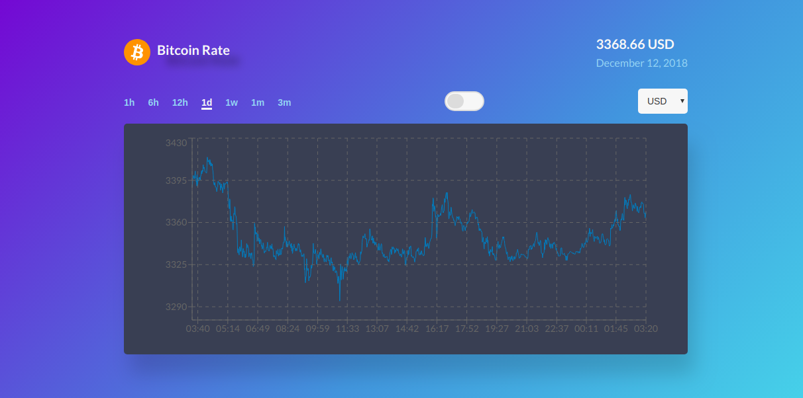

# Bitcoin rates app

> **Watch the Bitcoin's rates in real-time seamlessly**

This application shows the bitcoin's rates in real-time and allows you to filter the rates by hours, dates, weeks or months.



- demo: [https://bitcoin-rates.netlify.com/](https://bitcoin-rates.netlify.com/)

## Install and run

- `Dev env`

  Run the following commands in your terminal:

  - with yarn

    ```bash
    $ yarn
    $ yarn start
    ```

  - with npm

    ```bash
    $ npm install
    $ npm run start
    ```

- `Prod env`

  Run the following commands in your terminal:

  - with yarn

    ```bash
    $ yarn
    $ yarn build`
    ```

  - with npm

    ```bash
    $ npm install
    $ npm run build
    ```
